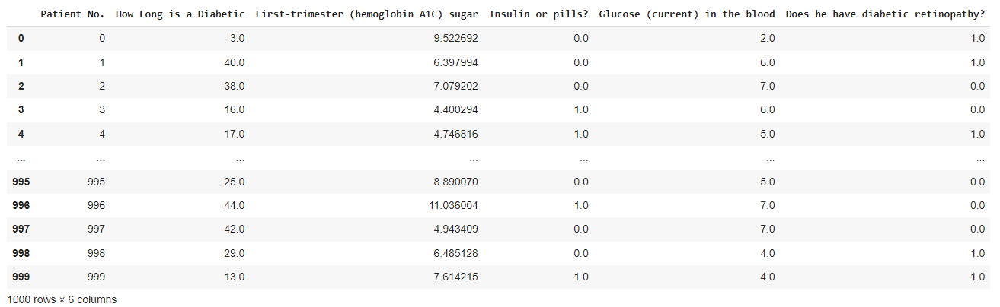

# Project Title :
Python Medicine Project.

## Project Overview :
This project involves data from 1000 diabetic patients over one year. The dataset includes information such as the duration of diabetes, 
hemoglobin A1C levels, treatment methods (insulin or tablets), current glucose levels, and the presence of diabetic retinopathy. The goal is to analyze and derive insights from the data, 
addressing issues like missing values, determining patient characteristics, and understanding factors influencing diabetic retinopathy.

## Project Highlights :
Data Cleaning and Preprocessing: With the "Diabetes_data.csv" dataset, our focus lies in addressing missing values to ensure data integrity.

Analysis of Glucose Levels: Identifying patients with the highest glucose levels, we create a plot illustrating all patients' glucose levels and conduct a comprehensive analysis of the data's behavior. Conclusions are drawn regarding variations in glucose levels.

Average A1C Levels and Disease Duration: We perform calculations for the average number of hemoglobin A1C levels per disease duration. Our objective is to determine which disease duration exhibits the highest average glucose levels. Visualizations have been crafted to offer insights into the data's behavior.

Treatment Comparison: Assessing the average disease duration for patients on insulin and tablets, we conduct a comparative analysis to ascertain which treatment method yields superior results.

Categorization of A1C Levels: Patients are categorized into two groups based on normal and elevated levels of hemoglobin A1C. A plot is generated, depending on the duration of the disease, to distinguish the two groups and provide valuable insights.

Analysis of Diabetic Retinopathy: A comprehensive investigation into factors influencing the presence of diabetic retinopathy is conducted. The correlation between diabetic retinopathy and other dataset variables is analyzed. Patients are divided into two groups, and insights into group characteristics are provided through the use of informative plots for visual representation.

## Project Preview :

